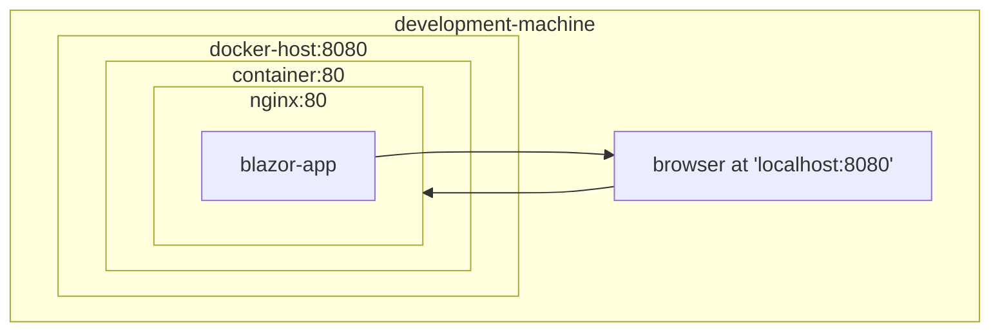

# ClaimIQ
Intelligent claims management

## Quick Reference

- Get AWS User: `aws sts get-caller-identity`

## Infrastructure as Code

| Environment | Technology | Configuration |
|-------------|------------|---------------|
| Local | Docker Compose | [docker-compose.yml](./docker-compose.yml) |
| AWS | CDK (TypeScript) | [infrastructure-stack.ts](./infrastructure/lib/infrastructure-stack.ts)

## Architecture

| Strategy | Developer-Obsessed | Customer-Obsessed | Notes |
|----------|--------------------|-------------------|-------|
| Deployment | <ul><li>Conatiner Everywhere<li>Engineering Purity<li>One patterm to learn | <ul><li>S3 + CloudFront<li>Global CDN<li>Lower cost<li>PWA potential enables offline features | 

### Client

- Phase 1 (POC)
  - S3 + CloudFront
- Phase 2 (MVP)
  - Container-based  APIs
  - Keep static client on S3
- Phase 3 (Scale)
  - Containers everywhere

| Environment | Configuration | Pros  | Cons |
|-------------|---------------|-------|------|
| Local | <ul><li>Docker containers<li>nginx serving wasm application | <ul><li>Containers all the way down<li>Fully encapsulated<li>Fully automated | <ul><li>Development experience isn't exactly like production
| AWS | <ul><li> S3 + CloudFront |  <ul><li>Worldwide performance on day 1<li>Low cost -> more runway<li>Works offline<li>Infinite scale<li>99.999% uptime | 

## Development Setup

From the project root:
- DEV
  - `docker-compose up claimiq-web-dev`
- STAGING
  - `docker-compose up claimiq-web-staging`

## Development Architecture
- Client Application: `ClaimIq.Web`